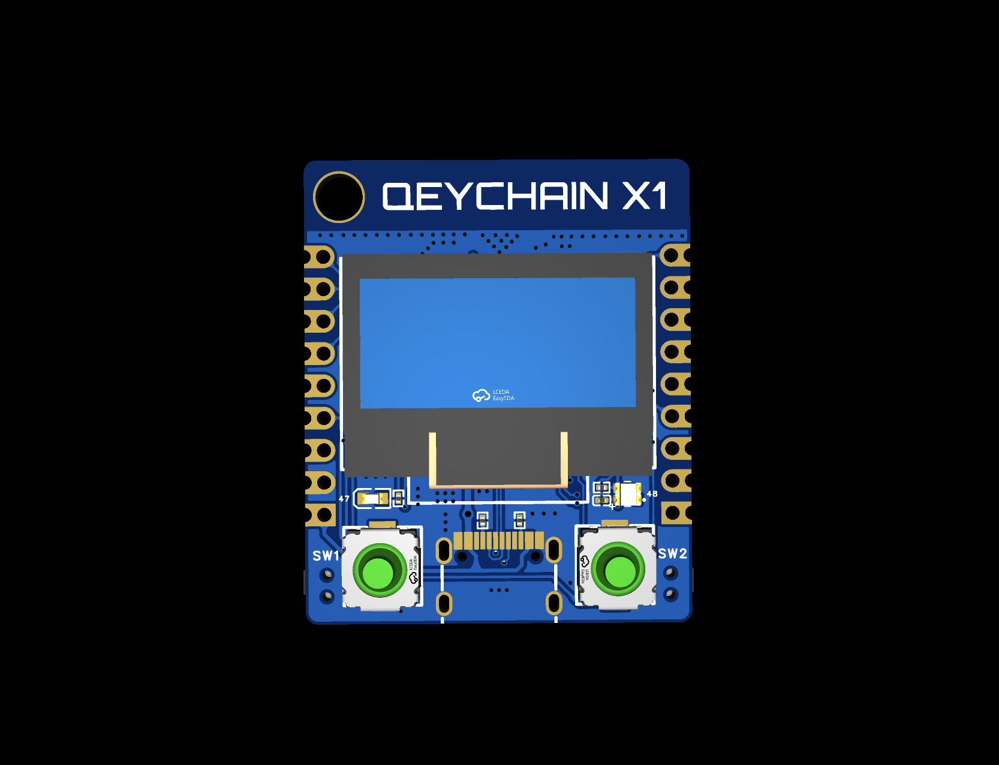
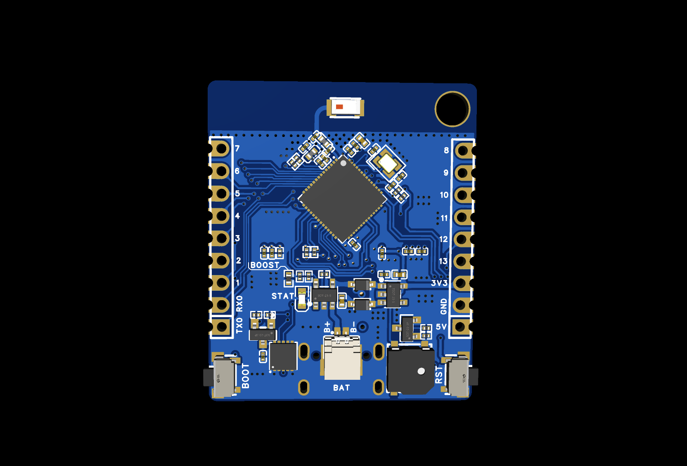

# QEYCHAIN

Every Bags need a Keychain! QEYCHAIN is a physical device that combines a secure element, OLED display, buttons, and USB-C into a compact board — designed to interact with the **Solana Tokens** through the **Bags API**.

Think of it as a tiny, portable device that can launch tokens, check token info, claim fees, and trade — all from a keychain-sized gadget.

<p align="center">
  
</p>


---

## What's on the Board

| Part | What it does |
|------|-------------|
| **ESP32-S3** | The brain. Runs firmware, connects via WiFi or USB |
| **OLED Display** (SSD1315) | Small screen to show token info, status, menus |
| **Secure Element** (OPTIGA Trust X) | Hardware-level crypto key storage |
| **2 Buttons** (SW1, SW2) | User input for navigating menus, confirming actions and could be short or long button in the future |
| **RGB LED** (WS2812B) | Status indicator with colors |
| **Indicator LED** | Simple on/off status light |
| **Buzzer** | Audio feedback (beeps on actions) |
| **USB-C** | Power + data connection |
| **Breakout Headers** (H1, H2) | 13 free GPIO pins for devs who want to add more hardware |

---

## How It Works

1. The QEYCHAIN board connects to the internet via WiFi (or through USB to a host computer)
2. It talks to the **Bags API** to do Solana token operations
3. The secure element keeps your private keys safe in hardware
4. Use the buttons to navigate and the OLED to see what's happening
5. LEDs and buzzer give visual/audio feedback

---

## GPIO Reference for Rust Developers

<p align="center">
  
</p>

If you're writing firmware in Rust (using `esp-hal` or `esp-idf-hal`), here's everything you need to know about the pins.


### Pin Assignments

```rust
// Core pin definitions for QEYCHAIN firmware
const PIN_OLED_RST: u8       = 14;  // Display reset (active-low pulse)
const PIN_I2C_SCL: u8        = 15;  // Shared I2C clock (OLED + Secure Element)
const PIN_I2C_SDA: u8        = 16;  // Shared I2C data  (OLED + Secure Element)
const PIN_SEC_PWR_EN_N: u8   = 17;  // Secure element power switch (active-LOW to enable)
const PIN_SEC_RST: u8        = 18;  // Secure element reset
const PIN_BUZZER: u8         = 21;  // Buzzer drive (active-high)
const PIN_BUTTON1: u8        = 38;  // SW1 — pressed = LOW (has hardware pull-up)
const PIN_BUTTON2: u8        = 39;  // SW2 — pressed = LOW (has hardware pull-up)
const PIN_STATUS_LED: u8     = 47;  // Indicator LED (active-high)
const PIN_RGB_LED: u8        = 48;  // WS2812B data line

const OLED_I2C_ADDR: u8      = 0x3C;
const OPTIGA_I2C_ADDR: u8    = 0x30;
```

### I2C Bus

Both the OLED display and the secure element share one I2C bus:

| Device | Address | SCL | SDA | Extra pins |
|--------|---------|-----|-----|------------|
| OLED (SSD1315) | `0x3C` | GPIO15 | GPIO16 | GPIO14 (reset) |
| Secure Element (OPTIGA Trust X) | `0x30` | GPIO15 | GPIO16 | GPIO17 (power), GPIO18 (reset) |

The board already has pull-up resistors on SCL/SDA — you do **not** need to enable internal pull-ups.

### Buttons

Both buttons are active-low with hardware pull-ups:
- **SW1** → GPIO38 — `LOW` when pressed, `HIGH` when released
- **SW2** → GPIO39 — `LOW` when pressed, `HIGH` when released

Use software debounce in your code.

### Startup Sequence (Rust pseudocode)

```rust
// 1. Configure outputs
let oled_rst = io.pins.gpio14.into_push_pull_output();
let sec_pwr = io.pins.gpio17.into_push_pull_output();
let sec_rst = io.pins.gpio18.into_push_pull_output();
let buzzer = io.pins.gpio21.into_push_pull_output();
let status_led = io.pins.gpio47.into_push_pull_output();

// 2. Configure inputs (buttons already have external pull-ups)
let btn1 = io.pins.gpio38.into_floating_input();
let btn2 = io.pins.gpio39.into_floating_input();

// 3. Power on the secure element
sec_pwr.set_low();   // active-low enables power

// 4. Reset the OLED
oled_rst.set_low();
delay.delay_ms(10u32);
oled_rst.set_high();

// 5. Start I2C
let i2c = I2C::new(peripherals.I2C0, sda_pin, scl_pin, 400.kHz());

// 6. Now you can talk to OLED at 0x3C and secure element at 0x30
```

### Free GPIOs on Breakout Headers

These pins are completely free for your own use:

**Header H1:**

| H1 Pin | GPIO | Capabilities |
|--------|------|-------------|
| 4 | GPIO13 | ADC2, Touch, RTC, Digital I/O |
| 5 | GPIO12 | ADC2, Touch, RTC, Digital I/O |
| 6 | GPIO11 | ADC2, Touch, RTC, Digital I/O |
| 7 | GPIO10 | ADC1, Touch, RTC, Digital I/O |
| 8 | GPIO9 | ADC1, Touch, RTC, Digital I/O |
| 9 | GPIO8 | ADC1, Touch, RTC, Digital I/O |

**Header H2:**

| H2 Pin | GPIO | Capabilities |
|--------|------|-------------|
| 1 | GPIO43 | UART0 TX (shared with serial console) |
| 2 | GPIO44 | UART0 RX (shared with serial console) |
| 3 | GPIO1 | ADC1, Touch, RTC, Digital I/O |
| 4 | GPIO2 | ADC1, Touch, RTC, Digital I/O |
| 5 | GPIO3 | ADC1, Touch, RTC, Digital I/O (strapping pin — careful at boot) |
| 6 | GPIO4 | ADC1, Touch, RTC, Digital I/O |
| 7 | GPIO5 | ADC1, Touch, RTC, Digital I/O |
| 8 | GPIO6 | ADC1, Touch, RTC, Digital I/O |
| 9 | GPIO7 | ADC1, Touch, RTC, Digital I/O |

### Pins to Avoid

| GPIO | Why |
|------|-----|
| GPIO0 | Boot strapping pin |
| GPIO19/20 | USB D-/D+ |
| GPIO45/46 | Strapping pins |
| GPIO15/16 | Shared I2C bus (already in use) |

---


## Bags Hackathon

Here's why QEYCHAIN is a strong hackathon entry:

### The Pitch

> **"Launch and manage tokens from a physical device the size of a keychain."**

No one else is building hardware wallets that directly integrate with the Bags token launch and fee-sharing infrastructure. QEYCHAIN bridges the gap between physical crypto security and the Bags ecosystem.

### Key Features for the Hackathon

1. **One-Button Token Launch** — Walk through the entire token creation flow using the OLED + buttons. Secure element signs everything. No laptop needed after initial WiFi config.

2. **Live Token Feed on Hardware** — Scroll through the Bags token launch feed on a tiny OLED screen. See token names, symbols, and status in real-time.

3. **Hardware-Signed Swaps** — Get trade quotes and execute swaps where the private key never leaves the secure element.

4. **Fee Dashboard** — Check your claimable fees across all tokens, claim them with a button press, and get a buzzer beep when the transaction confirms.

5. **Fee Share Management** — View and update fee share configurations for tokens you admin, all from the device.

6. **Everyone can make keychain** - Open source hardware make everyone can print their own PCB and assembly it at home.

---

## PCB Design Files

Everything you need to inspect, manufacture, or modify the QEYCHAIN X1 board lives in the [`PCB/`](PCB/) folder:

```
PCB/
├── Qeychain_SCH.pdf                           # Full schematic (PDF)
├── BOM_QEYCHAIN_Schematic1_2026-03-17.xlsx    # Bill of Materials (Excel)
├── Gerber_Qeychain_X1.zip                     # Gerber files (ready for fab)
└── images/
    ├── front-design.png                       # Front board render
    └── back-design.png                        # Back board render
```

| File | What it is | When you need it |
|------|-----------|-----------------|
| [Qeychain_SCH.pdf](PCB/Qeychain_SCH.pdf) | **Schematic** — complete circuit diagram showing every component, net, and connection on the board. Use this to understand how the ESP32-S3 connects to the OLED, secure element, buttons, LEDs, buzzer, and USB-C. | Debugging hardware, tracing signals, writing drivers, understanding pin relationships |
| [BOM_QEYCHAIN_Schematic1_2026-03-17.xlsx](PCB/BOM_QEYCHAIN_Schematic1_2026-03-17.xlsx) | **Bill of Materials** — lists every component (resistors, capacitors, ICs, connectors, etc.) with part numbers, values, footprints, and quantities. This is your shopping list. | Ordering parts, sourcing components, building your own board |
| [Gerber_Qeychain_X1.zip](PCB/Gerber_Qeychain_X1.zip) | **Gerber files** — industry-standard manufacturing files that define every copper layer, solder mask, silkscreen, and drill hole. Upload this zip directly to any PCB fab house (JLCPCB, PCBWay, OSH Park, etc.) to get boards made. | Ordering PCBs from a manufacturer |

